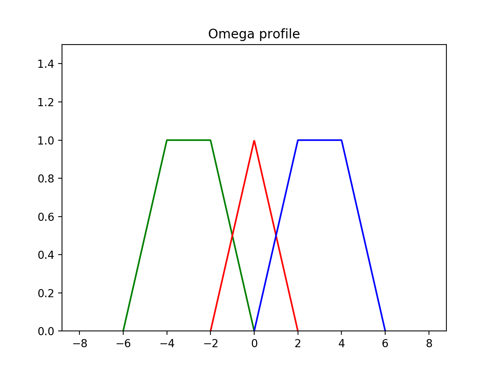

# Fuzzy Controller for Inverted Pendulum

## Introduction
Fuzzy logic is a form of many-valued logic in which the truth values of variables may be any real number between 0 and 1 inclusive. It is employed to handle the concept of partial truth, where the truth value may range between completely true and completely false. By contrast, in Boolean logic, the truth values of variables may only be the integer values 0 or 1. This assignment contains a program to control an inverted pendulum using Fuzzy Logic.

## Process
1. Fuzzify all input values into fuzzy membership functions.
2. Execute all applicable rules in the rulebase to compute the fuzzy output functions.
3. De-fuzzify the fuzzy output functions to get "crisp" output values.

## Goal
The goal is to keep the inverted pendulum in vertical position (θ=0)
in dynamic equilibrium. Whenever the pendulum departs
from vertical, a torque is produced by sending a current 'i'

**Controlling factors for appropriate current**
Angle and angular velocity

The profile for the Theta angle is as follows

The profile for the Omega is as follows

## Requirements
1. pygame
2. python3
3. matplotlib

## Sample Run

